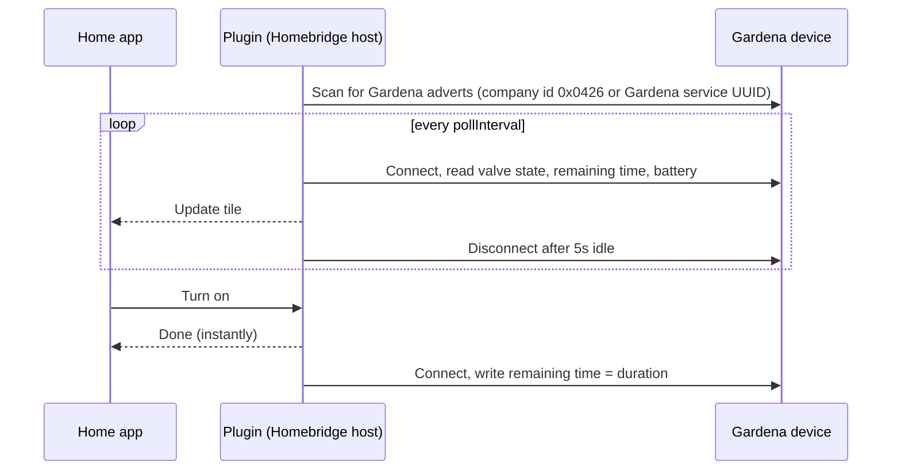

# homebridge-gardena-bluetooth

Control Gardena Bluetooth water controls from HomeKit. Each device appears as an irrigation valve with a run timer and battery level.

Supported devices (the ones exposing Gardena's classic valve service):

- Water Control Bluetooth (01889-20)
- Irrigation Valve 9V Bluetooth (1285-20), firmware 1.7.23.29 or newer

The protocol comes from [gardena-bluetooth](https://github.com/elupus/gardena-bluetooth), the reverse-engineered library behind Home Assistant's integration.

## How the Bluetooth link works



- The Bluetooth radio is the one in the machine running Homebridge. There is no hub or cloud, so that machine has to be within BLE range of the tap, typically 10 to 30 m with walls in the way.
- The plugin connects only while it has work to do, then drops the link to save the device's batteries.
- HomeKit reads come from a cache, so the Home app never waits on Bluetooth. Turning the valve on or off returns immediately. If the write fails, the tile reverts and the error is logged.
- The device runs the timer itself. Once it starts watering it stops on schedule even if Homebridge goes offline.
- After three failed polls in a row the tile shows "No Response", so a stale state is never shown as live. It recovers on the next successful poll.
- All devices share one adapter, so the plugin talks to one device at a time.

## Quick test on a laptop

No Homebridge install needed. Prebuilt Bluetooth binaries ship for macOS, Raspberry Pi and x64 Linux, so there's nothing to compile.

1. Copy this folder to the laptop, take it within range of the tap, and run:
   ```sh
   npm install
   npm run dev
   ```
   On macOS, allow Bluetooth access for your terminal app when asked.
2. Wait about 30 seconds. The log lists every Gardena device it sees, then `Scan finished`.
3. Put the address into `devices` in `dev/config.json`, for example `{ "address": "...", "name": "Garden Tap" }`, then run `npm run dev` again. The log shows the model, firmware, valve state and battery on every poll.
4. Optionally, pair the dev bridge in the Home app with code `031-45-154` and try the tile. Remove the bridge from the Home app afterwards.

On macOS the address is a CoreBluetooth UUID that only that Mac recognises. When you move to your real Homebridge, scan again there for its address.

## Setup

1. **Free the device.** It accepts one controller at a time. Close the Gardena app and turn off Bluetooth on any phone that has paired with it. If the plugin times out connecting, factory reset the device as described in its manual.
2. **Install** on the Homebridge host. Build the tarball with `npm pack`, copy it over, then:
   - Official Raspberry Pi image or apt package (`hb-service`). It bundles its own Node, so use that one:
     ```sh
     sudo -u homebridge /opt/homebridge/bin/npm --prefix /var/lib/homebridge install /path/to/homebridge-gardena-bluetooth-0.1.0.tgz
     ```
   - Any other setup: run `npm install /path/to/homebridge-gardena-bluetooth-0.1.0.tgz` in your Homebridge storage folder.
3. **Linux only:** let Node use the Bluetooth adapter without root. Point `setcap` at the Node binary that runs Homebridge, which is `/opt/homebridge/bin/node` for `hb-service` installs:
   ```sh
   sudo apt install libcap2-bin
   sudo setcap cap_net_raw,cap_net_admin+eip $(readlink -f /opt/homebridge/bin/node)
   ```
   Repeat this after every Node upgrade, then restart Homebridge.
4. **Find the address.** Add the platform with no devices and restart. The log lists each Gardena device it sees:
   ```
   Found Gardena device "Water Control" at c4:64:e3:12:34:56 (RSSI -71), not configured
   ```
5. **Configure** it in the Homebridge UI, or in `config.json`:
   ```json
   {
     "platform": "GardenaBluetooth",
     "name": "Gardena Bluetooth",
     "pollInterval": 60,
     "devices": [
       { "address": "c4:64:e3:12:34:56", "name": "Garden Tap", "defaultDuration": 900 }
     ]
   }
   ```
   `address` is the MAC address on Linux, or the CoreBluetooth UUID on macOS. Run it as a child bridge so a Bluetooth hiccup cannot take down your other accessories.

## Troubleshooting

| Symptom | Fix |
| --- | --- |
| `Bluetooth is unavailable` | Linux: rerun the `setcap` step. Docker: use `network_mode: host` and add the `NET_ADMIN` and `NET_RAW` capabilities. macOS: allow Bluetooth for your terminal or Node in System Settings, Privacy & Security. |
| `Still looking for ...` | The device is out of range or asleep. Check the RSSI in the log. Below about -90 the link is unreliable, so move the Homebridge host or add a USB Bluetooth adapter with an antenna. |
| `Timed out talking to device` | Another phone or hub holds the connection. Turn off Bluetooth on paired phones, or factory reset the device. |
| `no classic Gardena valve service` | Your model uses the newer hybrid protocol, which this plugin does not support yet. |

## Limits

- The device's own watering schedules aren't exposed. Use HomeKit automations instead.
- HomeKit caps a manual run at 60 minutes.
- Watering started with the button on the device shows up in HomeKit at the next poll, up to `pollInterval` seconds later. Live updates would mean holding the connection open, which drains the batteries.
- The soil moisture sensor isn't exposed yet.

## Development

```sh
npm install
npm test
npm run dev    # local Homebridge using dev/config.json
npm pack       # produces the tarball to install
```
